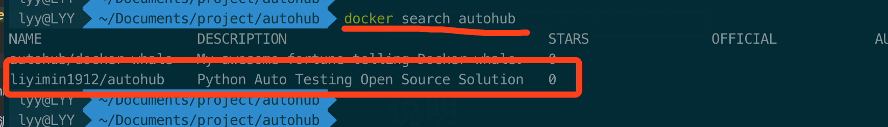
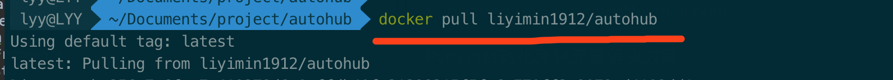
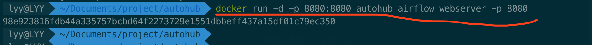
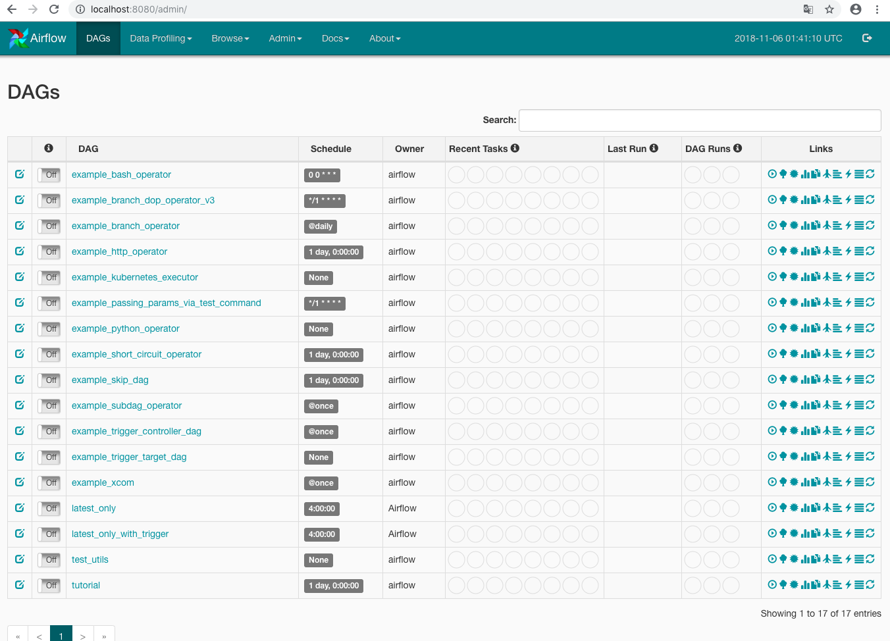

# autohub

Python Auto Testing Open Source Solution By 苦叶子

# 为什么要发起autohub项目

实践docker化的Python全栈自动化测试开源解决方案

实践测试即代码

# 如何使用

1 安装docker [安装手册](https://docs.docker.com/compose/install/)

2 查找autohub镜像

3 下载最新的docker镜像

4 启动autohub中的airflow

5. 访问airflow web界面

http://localhost:8080

这是默认的airflow

后续进一步更新autohub，以便大家了解如何基于autohub做企业级开源自动化测试解决方案

# 说明

Supported By：lymking@foxmail.com

Python自动化测试开源解决方案

- 编程语言：Python3
- web开发框架: Flask
- web自动化测试：Selenium Webdriver
- 移动测试：Appium
- 测试框架：RobotFramework
- 接口测试：Requests
- 数据测试：DataTest
- 基础框架：Pytest
- 调度工作流：AirFlow

等等基于Python的自动化测试基础包docker镜像

关注我的公众号： 开源优测

一起探讨基于Python的自动化测试开源解决方案的企业实践
