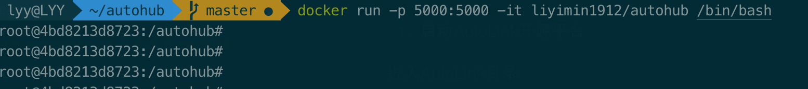
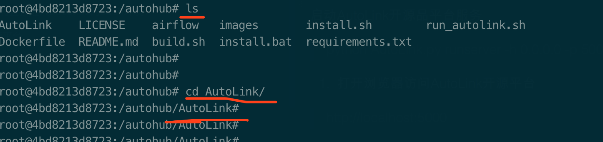
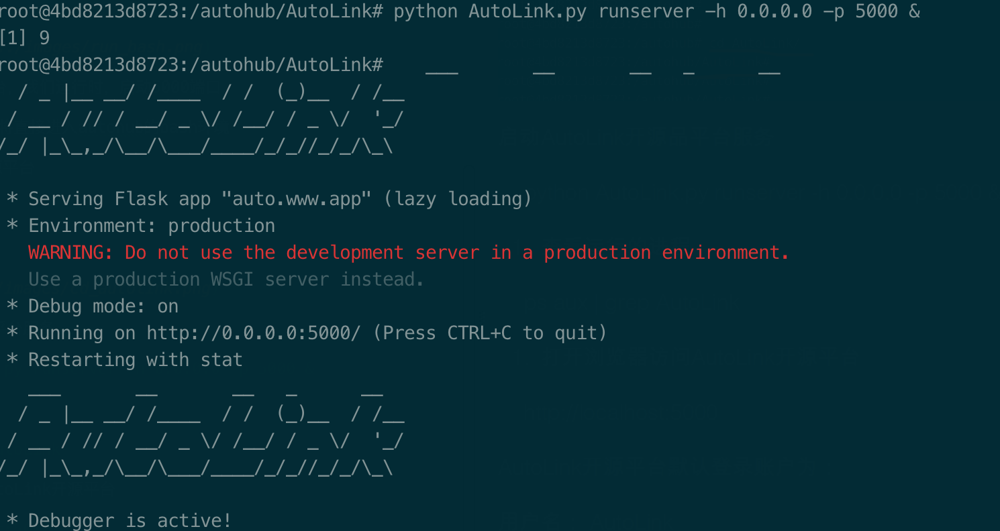
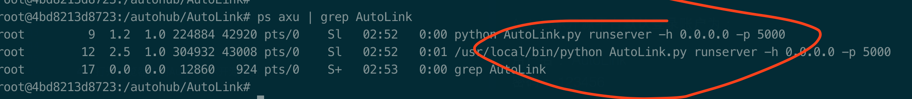
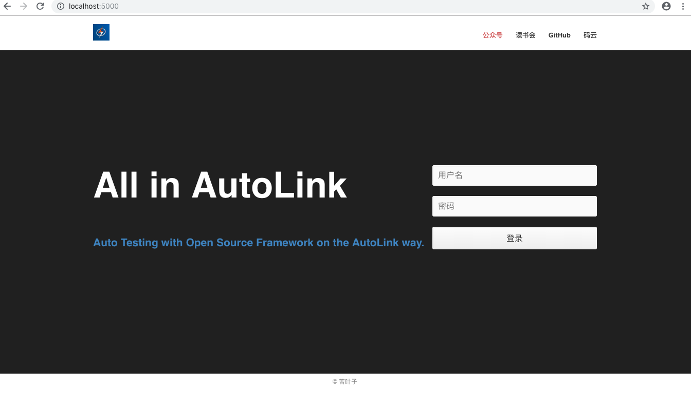
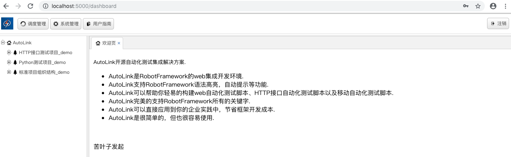

# 先决条件

1. 安装docker服务

2. 下载autohub docker镜像

或

2. 从Dockerfile文件自己build镜像

3. 按下列教程运行AutoLink开源平台

# 使用教程

1. 启动autohub的bash环境，并映射端口

> docker run -p 5000:5000 -it liyimin1912/autohub /bin/bash

如图：

注：AutoLink开源平台，我们运行时，启动5000端口

这里启动autohub后，将直接进入autohub的bash环境

2. 启动AutoLink开源平台

进入AutoLink目录

> cd AutoLink

启动AutoLink开源品平台服务

> python AutoLink.py runserver -h 0.0.0.0 -p 5000 &

3. 查看运行的进程

> ps aux | grep AutoLink

4. 打开浏览器访问AutoLink开源平台

> http://localhost:5000 

5. 登录

AutoLink开源平台默认登录账户为：

用户名： AutoLink  
密码：   123456

更多关于AutoLink请参见AutoLink项目： 

https://github.com/small99/AutoLink

